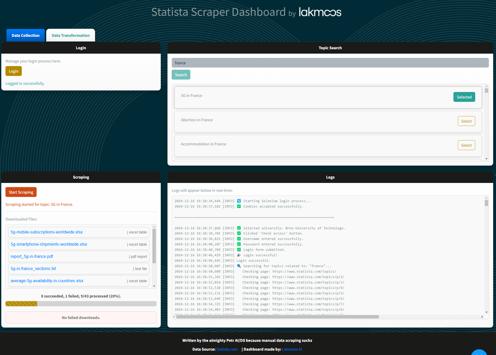

# Statista Scraper Project

## Table of Contents
1. [Introduction](#introduction)
2. [Features](#features)
3. [Setup and Installation](#setup-and-installation)
4. [Usage](#usage)
   - [Command-line Scraper](#command-line-scraper)
   - [Dashboard GUI](#dashboard-gui)
5. [Preview](#preview)
6. [Configuration](#configuration)
7. [Dependencies](#dependencies)
8. [Examples](#examples)
9. [Troubleshooting](#troubleshooting)
10. [Contributors](#contributors)
11. [License](#license)

---

## Introduction

The **Statista Scraper** is a Python-based project for automating the collection, transformation, and organization of data from Statista. It includes:
- A command-line script (`scraper.py`) for data scraping.
- A user-friendly web-based GUI built with Dash (`gui.py`).

The scraper allows users to log in, search for topics, and download associated data in formats like `.xlsx`, `.csv`, and `.pdf`.

---

## Features

- **Automated Login**: Secure login using Selenium with session cookie handling.
- **Topic Search**: Search and select specific topics from Statista.
- **Data Scraping**: Download reports, statistics, and raw data files in various formats.
- **Dashboard Interface**: Intuitive GUI for managing login, topic selection, and progress tracking.
- **Logging**: Comprehensive logging for troubleshooting and debugging.

---

## Setup and Installation

1. **Clone the repository**:
    ```bash
    git clone https://github.com/your-repo/statista-scraper.git
    cd statista-scraper
    ```

2. **Install dependencies using Poetry**:
    ```bash
    poetry install
    ```

3. **Activate the virtual environment**:
    ```bash
    poetry shell
    ```

4. **Set up environment variables**:
    - Create a `.env` file in the root directory:
        ```env
        STATISTA_USERNAME=your_username
        STATISTA_PASSWORD=your_password
        ```

5. **Install ChromeDriver**:
    The script uses `chromedriver_autoinstaller` to automatically install the required ChromeDriver version.

---

## Usage

### Command-line Scraper

To run the scraper script:
```bash
poetry run python scraper.py
```

### Dashboard GUI

To launch the GUI:
```bash
poetry run python gui.py
```

Access the web app at `http://127.0.0.1:8050` in your browser.

---

## Preview

Below is a preview of the Statista Scraper dashboard interface:



## Configuration

Modify the following settings in `scraper.py` as needed:
- `LOGIN_URL`: The login URL for Statista.
- `TOPICS_URL`: The base URL for topics.
- `DEST_FOLDER`: Directory for saving downloaded files.

---

## Dependencies

- Python 3.7+
- Managed using Poetry. All dependencies are listed in `pyproject.toml`.

---

## Examples

### Searching for a Topic
1. Enter the desired topic (e.g., "France") in the GUI.
2. Select the desired topic from the search results.
3. Start the scraping process.

### Downloaded Files
Scraped files are saved in the `statista_data` directory, organized by topic.

---

## Troubleshooting

- **Login Errors**: Ensure correct username and password in the `.env` file.
- **Browser Issues**: Verify that Google Chrome is installed and up-to-date.
- **Failed Downloads**: Check `scraper.log` for error details.

---

## Contributors

- **Petr AI/DS**: Developer and maintainer.
- **Lakmoos AI**: Dashboard design and implementation.

---

## License

This project is licensed under the MIT License. See the `LICENSE` file for details.
